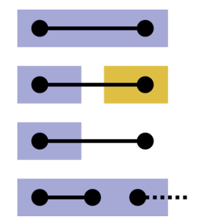

# SkeletonMetrics

[](LICENSE)


[](https://github.com/semantic-release/semantic-release)

Python package for assessing the accuracy of a predicted neuron segmentation by comparing it to a set of ground truth skeletons. This tool detects topological mistakes, such as splits and merges, in the predicted segmentation and then computes several skeleton-based metrics that quantify its topological accuracy.

## Details

Ground truth skeletons must be stored as SWC files so that each can be represented as a graph with xyz coordinates as a node-level attribute. The evaluation is performed by first labeling the nodes of ground truth skeletons with the corresponding segment ids from the predicted segmentation. Topological mistakes are then detected by examining the labels of each edge.

<p>
  
  <br>
  <b> Figure: </b>Edges in skeletons are either correctly or incorrectly reconstructed based on the presence of mergers or splits that affect nodes attached to an edge. Colors correspond to segment IDs. From top to bottom: correct edge (both nodes have the same ID), split edge (nodes assigned to different segments), omitted edge (one or two nodes do not have an associated ID), merged edge (node assigned to a segment that covers more than one skeleton).
</p>

Metrics computed for each ground truth skeleton:

- Number of Splits: Number of segments that a ground truth skeleton is broken into.
- Number of Merges: Number of segments that are incorrectly merged into a single segment.
- Percentage of Omit Edges: Proportion of edges in the ground truth that are omitted in the predicted segmentation.
- Percentage of Merged Edges: Proportion of edges that are merged in the predicted segmentation.
- Edge Accuracy: Proportion of edges that are correctly reconstructed in the predicted segmentation.
- Expected Run Length (ERL): Expected length of segments or edges in the predicted segmentation.

## Usage

Here is a simple example of evaluating a predicted segmentation.

```python
from tifffile import imread
from xlwt import Workbook

import numpy as np

from segmentation_skeleton_metrics.skeleton_metric import SkeletonMetric


def evaluate():
    # Initializations
    pred_labels = imread(pred_labels_path)
    skeleton_metric = SkeletonMetric(
        target_swcs_pointer,
        pred_labels,
        fragments_pointer=pred_swcs_pointer,
        output_dir=output_dir,
    )
    full_results, avg_results = skeleton_metric.run()

    # Report results
    print(f"Averaged Results...")
    for key in avg_results.keys():
        print(f"   {key}: {round(avg_results[key], 4)}")

    print(f"\nTotal Results...")
    print("# splits:", np.sum(list(skeleton_metric.split_cnt.values())))
    print("# merges:", np.sum(list(skeleton_metric.merge_cnt.values())))


if __name__ == "__main__":
    # Initializations
    output_dir = "./"
    pred_labels_path = "./pred_labels.tif"
    pred_swcs_pointer = "./pred_swcs.zip"
    target_swcs_pointer = "./target_swcs.zip"

    # Run
    evaluate()


```


## Installation
To use the software, in the root directory, run
```bash
pip install -e .
```

To develop the code, run
```bash
pip install -e .[dev]
```

To install this package from PyPI, run
```bash
pip install aind-segmentation-evaluation
```
