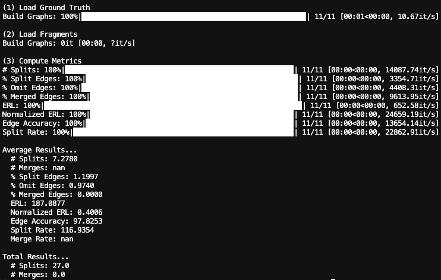

# SkeletonMetrics

[](LICENSE)


[](https://github.com/semantic-release/semantic-release)

Python package that evaluates the topological accuracy of a predicted neuron segmentation by comparing it to a set of ground truth skeletons. Topological errors (e.g. splits and merges) are detected by examining skeleton edges and checking if the corresponding nodes belong to the same object in the segmentation. Once the accuracy of each edge has been determined, several skeleton-based metrics are then computed to quantify the topological accuracy.

The pipeline for computing skeleton metrics consists of three main steps:

<blockquote>
  <p>a. <strong>Label Graphs</strong>: To do...</p>
  <p>b. <strong>Error Detection</strong>: To do...</p>
  <p>c. <strong>Compute Metrics</strong>: To do...</p>
</blockquote>
<br>

<p>
  
  <br>
  <b> Figure: </b>Visualization of skeleton metric computation pipeline, see Method section for description of each step.
</p>

## Method

### Step 1: Label Graphs

We begin with a set of ground truth skeletons stored as individual SWC files, where the "xyz" coordinates correspond to voxels in an image. Each ground truth skeleton is loaded and represented as a NetworkX graph with the voxel coordinates as a node-level attribute. The evaluation is performed by first labeling the nodes of each graph with the corresponding segment IDs from the predicted segmentation.


### Step 2: Error Detection

To do...

<p>
  
  <br>
  <b> Figure: </b>Edges from skeleton superimposed on segmentation, where colors represent to segment IDs. From top to bottom: correct edge (nodes have same segment ID), split edge (nodes have different segment IDs), omit edge (one or two nodes do not have a segment ID), merged edge (segment intersects with multiple skeletons).
</p>

### Step 3: Compute Metrics

To do...

- Number of Splits: Number of segments that a ground truth skeleton is broken into.
- Number of Merges: Number of segments that are incorrectly merged into a single segment.
- Percentage of Omit Edges: Proportion of edges in the ground truth that are omitted in the predicted segmentation.
- Percentage of Merged Edges: Proportion of edges that are merged in the predicted segmentation.
- Edge Accuracy: Proportion of edges that are correctly reconstructed in the predicted segmentation.
- Expected Run Length (ERL): Expected length of segments or edges in the predicted segmentation.


## Usage

Here is a simple example of evaluating a predicted segmentation.

```python
from tifffile import imread
from xlwt import Workbook

import numpy as np

from segmentation_skeleton_metrics.skeleton_metric import SkeletonMetric


def evaluate():
    # Initializations
    pred_labels = imread(pred_labels_path)
    skeleton_metric = SkeletonMetric(
        groundtruth_path,
        pred_segmentation_path,
        pred_fragments_path=pred_fragments_path,
        output_dir=output_dir,
    )
    full_results, avg_results = skeleton_metric.run()

    # Report results
    print(f"Averaged Results...")
    for stat_name in avg_results.keys():
        print(f"   {stat_name}: {round(avg_results[stat_name], 4)}")

    print(f"\nTotal Results...")
    print("# splits:", np.sum(list(skeleton_metric.split_cnt.values())))
    print("# merges:", np.sum(list(skeleton_metric.merge_cnt.values())))


if __name__ == "__main__":
    # Initializations
    output_dir = "./"
    groundtruth_path = "./target_swcs.zip"
    pred_segmentation_path = "./pred_labels.tif"
    pred_fragments_path = "./pred_swcs.zip"

    # Run
    evaluate()


```

<p>
  
</p>

Note: this Python package can also be used to evaluate the accuracy of a segmentation in which split mistakes have been corrected.

## Installation
To use the software, in the root directory, run
```bash
pip install -e .
```

## License
segmentation-skeleton-metrics is licensed under the MIT License.
