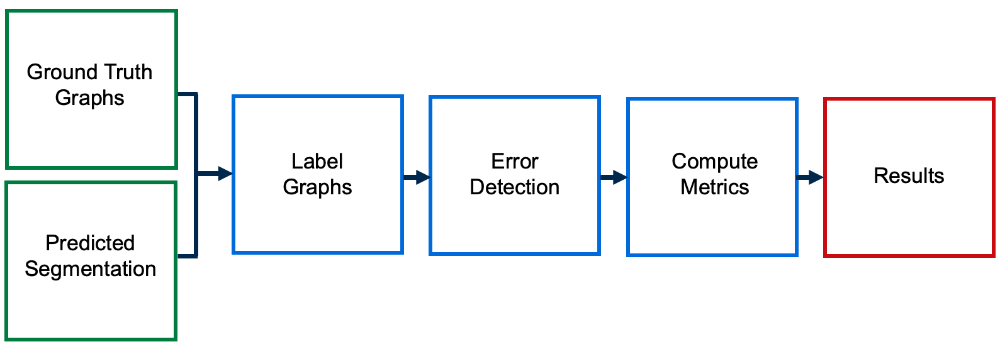
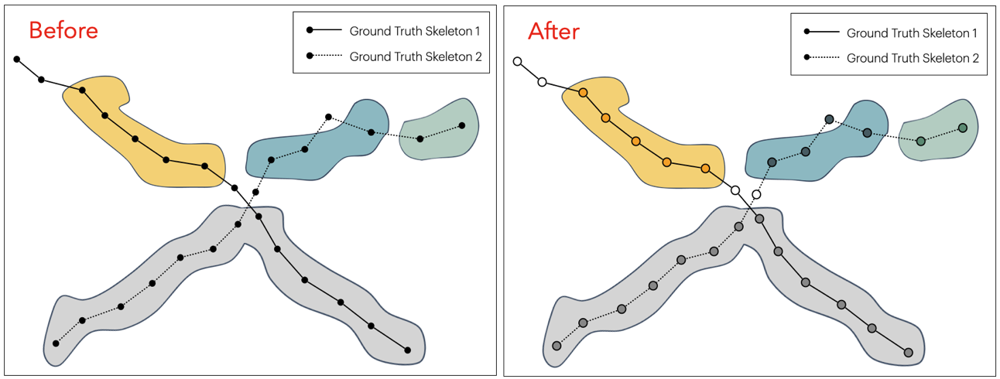

# SkeletonMetrics

[](LICENSE)


[](https://github.com/semantic-release/semantic-release)

Python package that evaluates the topological accuracy of a predicted neuron segmentation by comparing it to a set of ground truth skeletons (i.e. graphs). Topological errors (e.g. splits and merges) are detected by examining skeleton edges and checking if the corresponding nodes belong to the same object in the segmentation. Once the accuracy of each edge has been determined, several skeleton-based metrics are computed to quantify the topological accuracy.

<b> Note: </b> This repository is an implementation of the skeleton-based metrics described in [High-Precision Automated Reconstruction of Neurons with Flood-filling Networks](https://www.biorxiv.org/content/10.1101/200675v1.full.pdf)


## Overview

The pipeline for computing skeleton metrics consists of three main steps:

<blockquote>
  <p>1. <strong>Label Graphs</strong>: Nodes in ground truth graphs are labeled with segmentation IDs.</p>
  <p>2. <strong>Error Detection</strong>: Compare labels of neighboring nodes to detect mistakes.</p>
  <p>3. <strong>Compute Metrics</strong>: Update graph structure by removing omit nodes and compute skeleton-based metrics.</p>
</blockquote>
<br>

<p>
  
  <br>
  <b> Figure:</b> Visualization of skeleton metric computation pipeline, see Method section for description of each step.
</p>

## Method

### Step 1: Label Graphs

The process starts with a collection of ground truth graphs, each stored as an individual SWC file, where the "xyz" attribute represents voxel coordinates in an image. Each ground truth graph is loaded and represented as a custom NetworkX graph with these coordinates as a node-level attribute. The nodes of each graph are then labeled with their corresponding segment IDs from the predicted segmentation.

<p>
  
  <br>
  <b>Figure:</b> On the left, ground truth graphs are superimposed on a segmentation where colors represent segment IDs. On the right, the nodes of the graphs have been labeled with the corresponding segment IDs.</b> 
</p>

### Step 2: Error Detection

<p>
  
  <br>
  <b> Figure: </b> From top to bottom: correct edge (nodes have same segment ID), omit edge (at least one node does not have a segment ID), split edge (nodes have different segment IDs), merged edge (segment intersects with multiple graphs).
</p>

### Step 3: Compute Metrics

Lastly, we compute the following skeleton-based metrics:

- *\# Splits*: Number of connected components (minus 1) in a ground truth graph after removing omit nodes.
- *\# Merges*: Number of ground truth graphs that contain at least one merge.
- *Omit Edge Ratio*: Proportion of omitted edges.
- *Split Edge Ratio*: Proportion of split edges.
- *Merged Edge Ratio*: Proportion of merged edges.
- *Edge Accuracy*: Proportion of edges that are correct.
- *Expected Run Length (ERL)*: Expected run length of ground truth graph after removing omit nodes.

## Installation
To use the software, in the root directory, run
```bash
pip install -e .
```

## Usage

Here is a simple example of evaluating a predicted segmentation.

```python
from segmentation_skeleton_metrics.skeleton_metric import SkeletonMetric
from segmentation_skeleton_metrics.utils.img_util import TiffReader


# Initializations
output_dir = "./"
segmentation_path = "./pred_labels.tif"
fragments_pointer = "./pred_swcs.zip"
groundtruth_pointer = "./target_swcs.zip"

# Run
segmentation = TiffReader(segmentation_path)
skeleton_metric = SkeletonMetric(
   groundtruth_pointer,
   segmentation,
   fragments_pointer=fragments_pointer,
   output_dir=output_dir,
)
skeleton_metric.run()
```

<p>
  
  <br>
  <b>Figure:</b> Example of printouts generated after running evaluation.
</p>

<br>

Note: this Python package can also be used to evaluate a segmentation in which split mistakes have been corrected.

## Contact Information
For any inquiries, feedback, or contributions, please do not hesitate to contact us. You can reach us via email at anna.grim@alleninstitute.org or connect on [LinkedIn](https://www.linkedin.com/in/anna-m-grim/).

## License
segmentation-skeleton-metrics is licensed under the MIT License.
